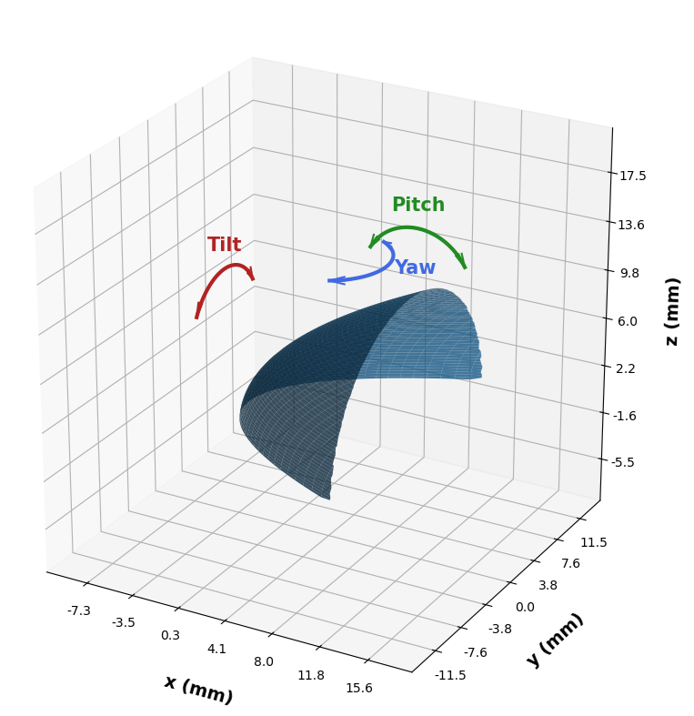
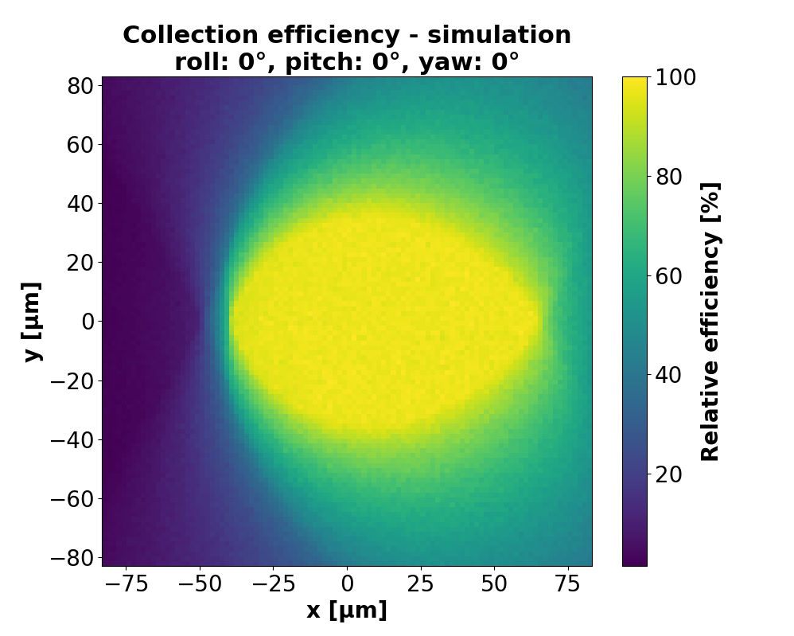

# CL Collection Efficiency Simulation
This project implements a ray-tracing engine designed to evaluate photon collection efficiency
of a cathodoluminescence (CL) detection assembly, which employs a parabolic mirror. The simulation 
enables the user to input mechanical misalignments (tilt, pitch yaw).



## Mirror Geometry
The model simulates a parabolic mirror defined by the equation:
$$x = \frac{y^2 + z^2}{4f} - f$$
where $f = 2.5 \text{ mm}$. The simulation accounts for physical constraints:
* **Central Aperture:** A hole for the primary electron beam ($d = 0.6 \text{ mm}$).
* **Vertical Truncation:** The mirror base is cut at $z = 0.5 \text{ mm}$ to accommodate the sample.
* **Acceptance Aperture:** An "effective detector radius" parameter to simulate the downstream optics.

## Structure
* src/geometry.py: Analytical geometry for intersections and reflections.
* src/vector_math.py: Vectorized operations and isotropic emission.
* src/simulation_engine.py: Orchestrates the ray-tracing for individual points.
* src/main.py: For running 2D raster scans and plotting results.

## Quick start
1. Clone the repository:
```bash
   git clone https://github.com/vilem-vojta/cl-ray-tracing-simulation.git
```
2. Install dependencies:
```bash
    pip install -r requirements.txt
```
3. Run the simulation:
```bash
    python src/main.py
```

